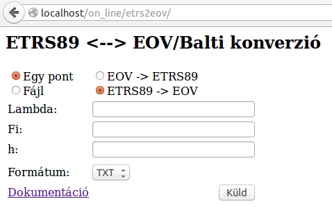

ETRF2000/ETRS89 <-> EOV/Balti átszámítás
========================================

Az **ETRF2000/ETRS89** földrajzi koordináták (hosszúság és szélesség,
ellipszoid feletti magasság) és az **EOV** koordináták, illetve **Balti**
magasság közötti átszámítását kezdetben a legtöbb szoftver deciméter pontosan
tudta csak elvégezni, mert az országosan egységes paraméterekkel végzett
hasonlósági transzformáció ennyire pontos a klasszikus geodéziai 
alapponthálózatok kerethibái miatt. Az átszámítás pontosítása érdekében a PROJ
programkönyvtár által 
használható javító rácsokat hoztunk létre. A javító rács használható a **cs2cs**
(PROJ segédprogram), az **ogr2ogr** (OGR segédprogram) és más PROJ könyvtárat
használó térinformatikai programokkal is mint például **QGIS**, **PostGIS**.
A javítórácsokat letöltheti a `GitHub oldalunkról 
<https://github.com/OSGeoLabBp/eov2etrs>`_, illetve a `PROJ projekt honlapjáról
<https://proj.org/resource_files.html#hungary>` is.
Emellett egy a böngészőből is elérhető **WEB**-es szolgáltatást is létrehoztunk,
mellyel egyesével vagy fájlban tárolt pontokat számíthatunk át a két rendszer 
között.

Telepítés
---------

A rácsfájlok bekerültek a PROJ 9.5.1 változatába és a hozzá tartozó PROJ-data
1.20 változatába. Innentől kezdve a rácshálók automatikusan települnek a gépre,s
ezért érdemes a PROJ könyvátrunkat frissíteni.

A korábbi programváltozatokhoz lásd a régebbi leírást: 
https://github.com/OSGeoLabBp/eov2etrs/blob/master/old_etrs2eov_doc.rst

Használat a QGIS programban
---------------------------

A QGIS program 3.40-es válozata már a proj 9.5.1 verzióját használja, ezért a
QGIS 3.40+ verzióiban az általunk elkészített és publikált rácshálók
automatikusan bekerülnek. A projekt, illetve rétegek koordináta-rendszerét
érdemes 10660 EPSG kódra állítani, és akkor az EOV vetületre végzett átszámítás
cm-es pontossággal végezhető.

Használat cs2cs segédprogramban
-------------------------------

A cs2cs (Coordinate System to Coordinate System) a PROJ 
programcsomaghoz tartozó parancssori segédprogram.  Windows felhasználók
például a OSGeo4W telepítővel telepíthetik. Segítségével a billentyűzetről
bevitt vagy fájlban tárolt pontokat számíthatunk át a PROJ könyvtár által
támogatott vetületek, koordináta-rendszerek között. Az átszámításokat az alábbi
példák alapján végezhetjük::

    cs2cs -f "%.9f" +init=epsg:10660 +to +init=epsg:7931
    650000.000 240000.000 150.000

Eredményül a következőket fogjuk kapni::

19.047447408    47.503933139 193.688921426

Ellenkező irányban::

    cs2cs -f "%.3f" +init=epsg:7931 +to +init=epsg:10660
    19.047447408    47.503933139 193.688921426

Eredményül mm pontosan vissza fogjuk kapni az eredeti koordinátákat és magasságot::

    650000.000      240000.000 150.000

Az eredményeket ellenőrizhetjük akár a webes alkalmazásunk (http://www.agt.bme.hu/on_line/etrs2eov),
vagy az EHT2014 (https://eht2.gnssnet.hu/) szolgáltatás segítségével.

Közvetlen használat a böngészőben
---------------------------------

A http://www.agt.bme.hu/on_line/etrs2eov címen érhető el a böngészőből
használható átszámítás.

Az egymás alatti rádiógombok tartoznak össze, az *Egy pont* és a *Fájl*
opció közötti váltás esetén az űrlap mezők megváltoznak, a két koordináta és a
magasság megadását lehetővé tevő két input mező helyett egy fájl kiválasztó
mező jelenik meg. Az *EOV/Balti->ETR89* illetve az *ETRS89->EOV/Balti*
átszámítási irány módosítása esetén a koordináta mezők előtti feliratok
változnak meg.

A *Formátum* mező az átszámítás eredményének formátumát befolyásolja. Csak az 
*EOV/Balti->ETRS89* átszámítás esetén válaszhat több formátum között, mivel a
KML és a GPX formátumok csak földrajzi koordinátákat tartalmazhatnak:

* TXT szóközzel elválasztva jelenik meg a pontszám és a két koordináta illetve a magasság
* KML különböző térinformatikai programokban használható formátum (pl. Google Earth, QGIS, stb.)
* GPX térinformatikai szoftverekben és navigációs GNSS vevőkben használható formátum (pl. Google Earth, QGIS, Garmin GPS vevők, stb.)

Fájlban tárolt pontok átszámítása esetén soronként egy pont adatait kell
megadni szóközzel, tabulátorral vagy pontosvesszővel elválasztva.
Az első mezőbe a pontszámnak, utána pedig a két koordinátának, majd a
magasságnak kell következnie,
A koordináták sorrendje felcserélhető a fájlban, például a szélesség megelőzheti
a hosszúságot. A magasságok megadása nem kötelező, üres mező is lehet. A
fájlban ezen három adat után tetszőleges további adatok szerepelhetnek, 
melyek szintén átkerülnek az outputba.
A numerikus értékek megadásánál tizedes vesszőt és tizedes pontot is használhat.

Az átszámítás eredménye egy új lapon jelenik meg. Az első oszlopban a
pontszám, a második oszlopban a hosszúság, illetve az EOV Y koordináta, a
harmadik oszlopban a szélesség, illetve az EOV X koordináta jelenik meg. Ha a
bemenő adatok között megadtuk az ellipszoidi, illetve a tengerszint feletti
magasságot, akkor az átszámított magasság az eredményében is megjelenik.
Egy pont átszámítása esetén mindig egyes pontszám jelenik meg. Az átszámítás
eredményeiben mindig tizedes pontot használ a program, attól függetlenül, hogy
mi volt az input adatokban.
Az eredményeket a böngésző program segítségével fájlba mentheti és más
programokban felhasználhatja.

Fájlban tárolt adatok átszámítása esetén a fájl méret maximum 15 MB lehet.

Az általunk készített javítórácsok segítségével az átszámítás 1 cm-en belül
megegyzik az EHT2014 szolgáltatással végzett átszámítással.

WEB-es szolgáltatás használata saját környezetből
-------------------------------------------------

A szerveren futó átszámítást HTTP GET vagy POST kérésekkel is használhatja.
Fájlban tárolt pontok esetén csak POST kérés használható.

A POST illetve GET kérések paraméterei:
* e - EOV y koordináta vagy ETRS hosszúság
* n - EOV x koordináta vagy ETRS szélesség
* h - Balti magasság vagy ellipszoid feletti magasság (opcionális)
* sfradio - értéke **single** vagy **file** lehet
* format - értéke **TXT** vagy **KLM** vagy **GPX** lehet, a KML és GPX formátumok

Például egy EOV koordinátákkal megadott pont átszámítását az alábbi URL megadásával is kezdeményezheti::

    http://www.agt.bme.hu/on_line/etrs2eov/etrs2eov.php?e=650000&n=240000&sfradio=single&format=TXT

Például egy EOV koordinátákkal, illetve Balti magassággal megadott pont átszámítását az alábbi URL megadásával is kezdeményezheti::

    http://www.agt.bme.hu/on_line/etrs2eov/etrs2eov.php?e=650000&n=240000&h=150&sfradio=single&format=TXT

Python programból az alábbi módon érheti el a szolgáltatást (egy pont átszámítása):: 

    >>> import urllib.request
    >>> req = urllib.request.urlopen('http://www.agt.bme.hu/on_line/etrs2eov/etrs2eov.php?e=650000&n=240000&sfradio=single&format=TXT').read()
    >>> printr(req)
    b'1 19.0474474 47.5039331\n'

vagy::
    
    >>> import urllib.parse
    >>> import urllib3
    >>> url = 'http://www.agt.bme.hu/on_line/etrs2eov/etrs2eov.php'
    >>> val = { 'e' : 650000, 'n' : 240000, 'sfradio' : 'single', 'format' : 'TXT' }
    >>> data = urllib.parse.urlencode(val)
    >>> http = urllib3.PoolManager()
    >>> res = http.request('POST', url, body=data)
    >>> print(res.read())
    b'1 19.0474474 47.5039331'

Használat az ogr2ogr segédprogramban
------------------------------------

**MÉG NEM AKTUALIZÁLT RÉSZ A ÚJ VÁLTOZATHOZ**

Az **ogr2ogr** a GDAL/OGR könyvtárhoz készült segédprogramok egyike. 
Segítségével különböző vektoros formátumok között alakíthatjuk át a 
térinformatikai állományainkat és vetületi átszámítást is végrehajthatunk 
közben. Sajnos az **ogr2ogr** program nem a proj.4 által használt vetületi 
definíciót használja, hanem egy csv fájlt (**pcs.csv** illetve **gcs.csv**),
mely eltérő formátumú is. Ebben nincs hely a javító rács megadására.

Szerencsére a vetületi definíciót az **ogr2ogr** a parancssorból is elfogadja. 
Például egy pontokat tartalmazó ESRI shape fájl átszámítását EOV-ból ETRS89-re::

    ogr2ogr -s_srs "+proj=somerc +lat_0=47.14439372222222 +lon_0=19.04857177777778 +k_0=0.99993 +x_0=650000 +y_0=200000 +ellps=GRS67 +nadgrids=etrs2eov_notowgs.gsb +units=m +no_defs" -t_srs EPSG:4258 -f "ESRI Shapefile" etrs89.shp eov.shp

Vigyázat, a parancsor végén először a cél állomány kell megadni és utána a forrás állományt!

Használat PostGIS programban
----------------------------

**MÉG NEM AKTUALIZÁLT RÉSZ A ÚJ VÁLTOZATHOZ**

A PostGIS a vetületi definíciókat a **spatial_ref_sys** táblában tárolja. 
Ennek tartalmát kell aktualizálnunk az EOV vetületre::

    UPDATE spatial_ref_sys SET proj4text='+proj=somerc +lat_0=47.14439372222222 +lon_0=19.04857177777778 +k_0=0.99993 +x_0=650000 +y_0=200000 +ellps=GRS67 +nadgrids=etrs2eov_notowgs.gsb +units=m +no_defs' WHERE srid=23700;
